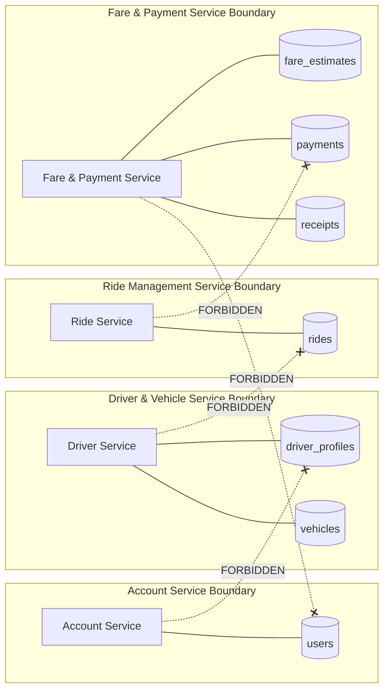

# RideLink Architecture & System Diagrams

## 1. High-Level System Architecture Diagram

```mermaid
graph TB
    subgraph Client_Layer["Client & Verification Tier"]
        POSTMAN["Postman Automated Test Suite"]
        SWAGGER["OpenAPI 3.0 / Swagger UI"]
    end

    subgraph Microservices_Tier["RideLink Microservices Mesh"]
        subgraph S1["Account Service (Port: 8081)"]
            S1_C["AuthController & UserController"]
            S1_S["Auth & Profile Management"]
        end

        subgraph S2["Driver & Vehicle Service (Port: 8082)"]
            S2_C["DriverController & VehicleController"]
            S2_S["Availability & 2dsphere Geo Search"]
        end

        subgraph S3["Ride Management Service (Port: 8083)"]
            S3_C["RideController"]
            S3_S["Ride Lifecycle State Machine"]
        end

        subgraph S4["Fare & Payment Service (Port: 8084)"]
            S4_C["FareController & PaymentController"]
            S4_S["Fare Calculation & Payment Simulator"]
        end
    end

    subgraph Persistence_Tier["Dedicated MongoDB Tier"]
        DB1[("MongoDB: ridelink_account_db\n(Port 27017)")]
        DB2[("MongoDB: ridelink_driver_db\n(Port 27017)")]
        DB3[("MongoDB: ridelink_ride_db\n(Port 27017)")]
        DB4[("MongoDB: ridelink_payment_db\n(Port 27017)")]
    end

    POSTMAN -->|REST / JWT| S1_C
    POSTMAN -->|REST / JWT| S2_C
    POSTMAN -->|REST / JWT| S3_C
    POSTMAN -->|REST / JWT| S4_C

    SWAGGER -.->|Docs| S1_C
    SWAGGER -.->|Docs| S2_C
    SWAGGER -.->|Docs| S3_C
    SWAGGER -.->|Docs| S4_C

    %% Inter-service HTTP calls
    S3_S -->|GET /api/v1/drivers/available\n(Find Eligible Drivers)| S2_C
    S3_S -->|POST /api/v1/payments/process
(Payment & Receipt)| S4_C
    S3_S -.->|PATCH /api/v1/drivers/{id}/availability\n(Driver Status Sync)| S2_C

    %% Database Ownership (Strict 1:1)
    S1_S ===>|Read/Write| DB1
    S2_S ===>|Read/Write| DB2
    S3_S ===>|Read/Write| DB3
    S4_S ===>|Read/Write| DB4
```

## 2. Database Ownership & Boundary Isolation


