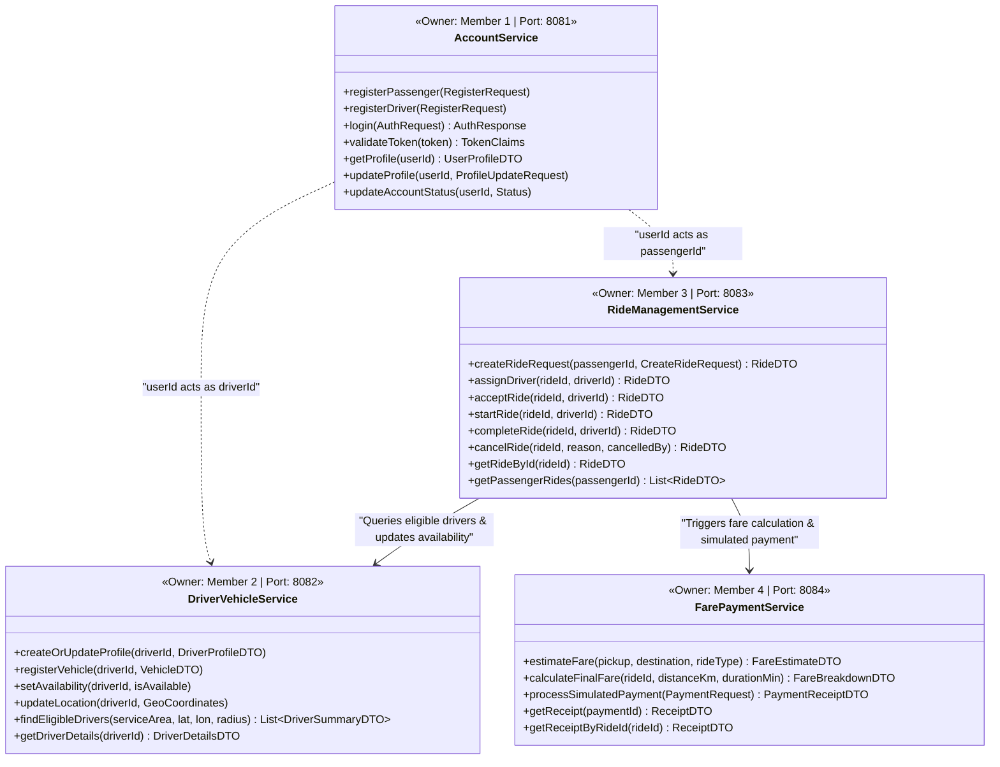
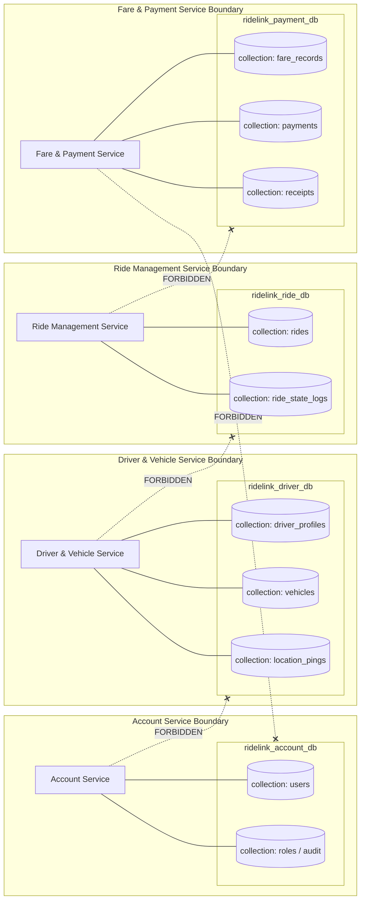
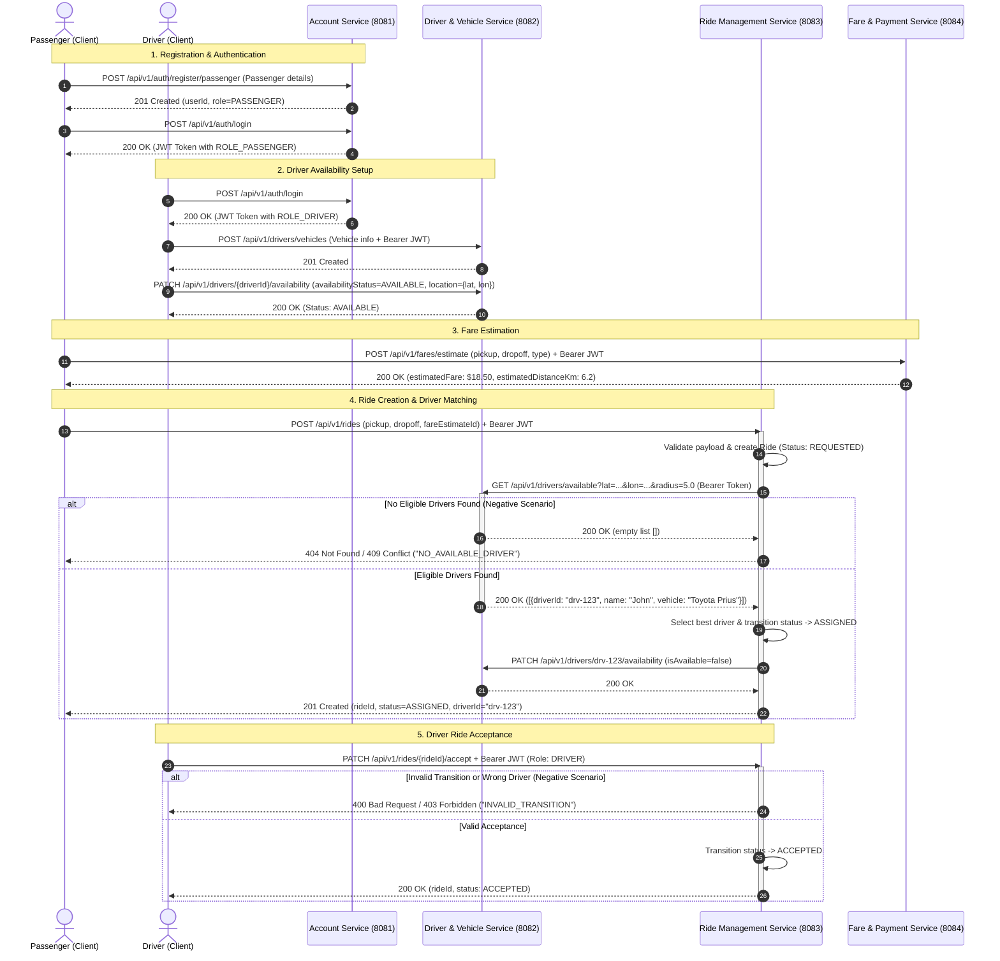
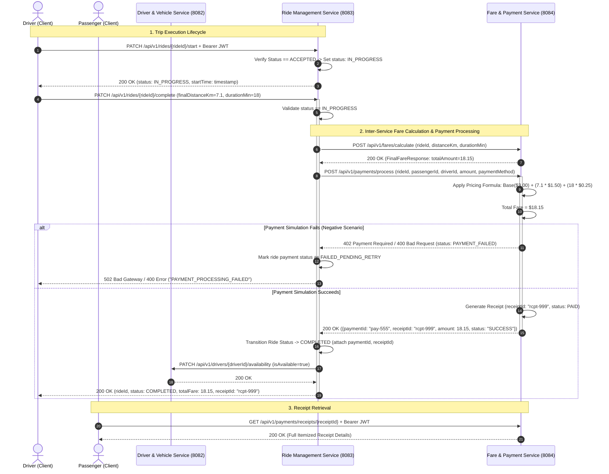
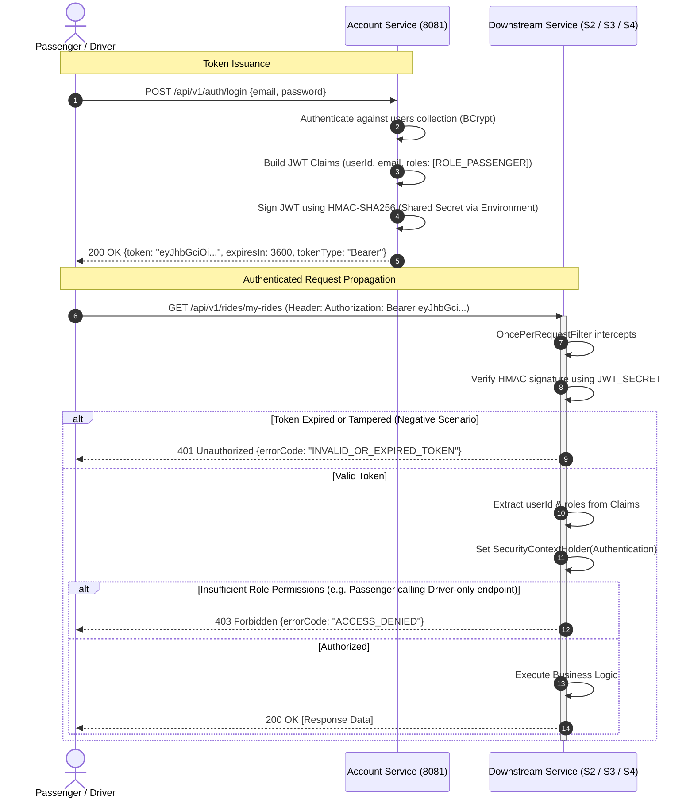
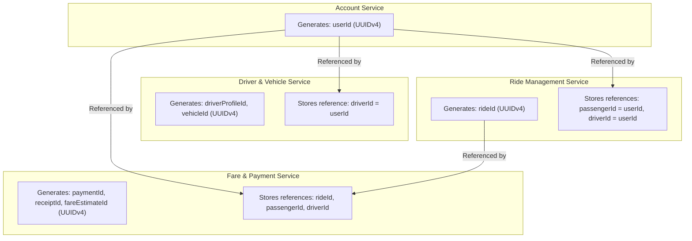
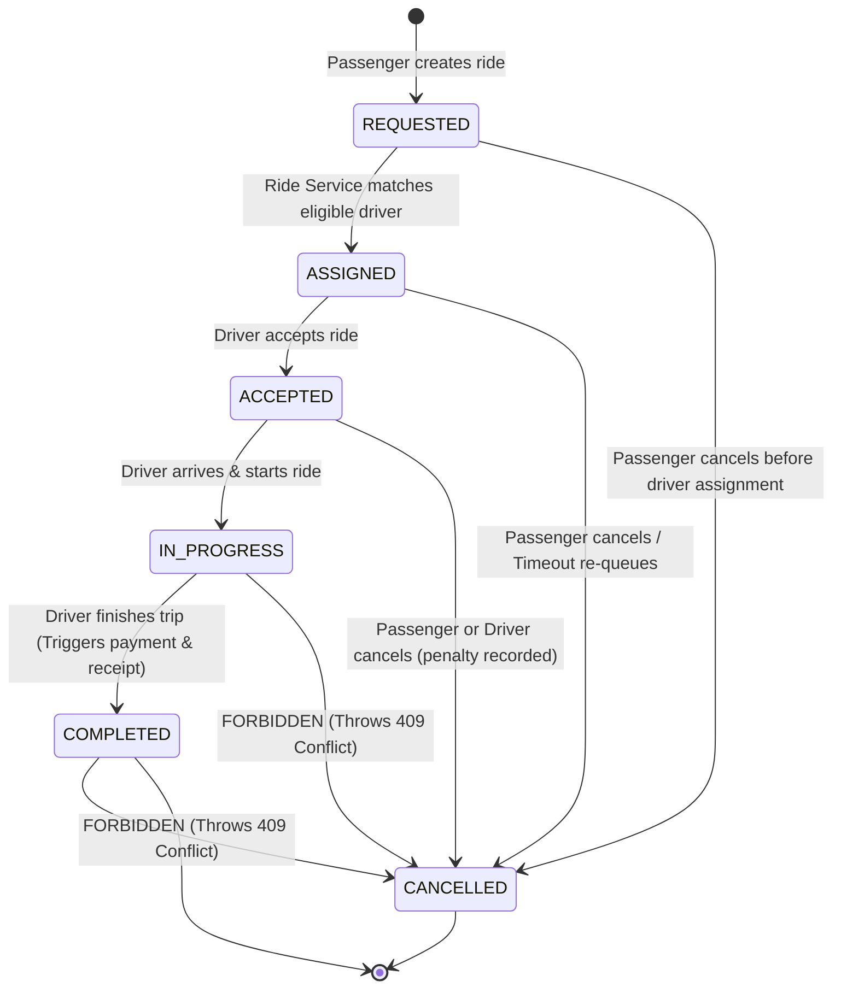
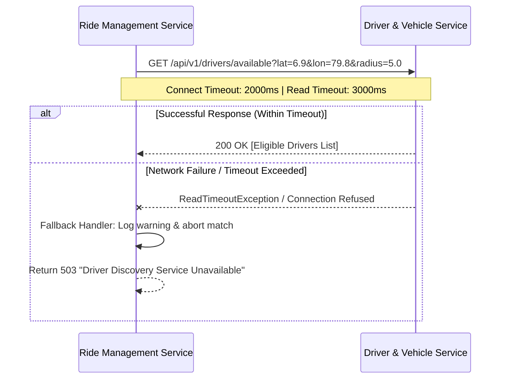
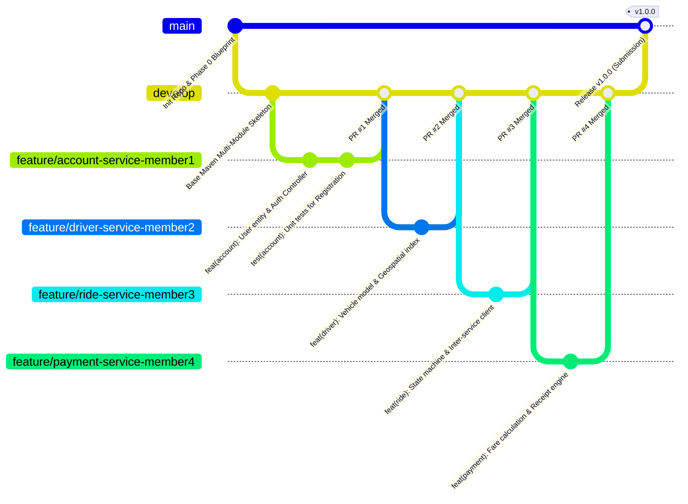
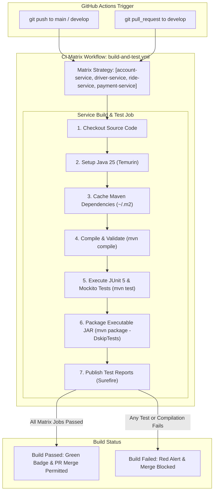

# RideLink Microservices Architecture Blueprint (Phase 0)

## Document Overview
* **Project Name**: RideLink Ride-Sharing Backend System
* **Course**: IT3130 Application Development
* **Architecture Style**: Microservices Architecture (Database-per-Service)
* **Technology Stack**: Java 25, Spring Boot 3.x, Spring Data MongoDB, Spring Security + JWT, OpenAPI/Swagger 3.0, Maven, JUnit 5, Mockito, GitHub Actions CI
* **Authors / Core Team**:
  * Member 1: Account Service Owner
  * Member 2: Driver & Vehicle Service Owner
  * Member 3: Ride Management Service Owner
  * Member 4: Fare & Payment Service Owner

---

## 1. System Architecture Diagram

The RideLink platform follows a decentralized microservices pattern. Clients (Swagger UI and Postman) interact with services over HTTP REST using JSON. Microservices authenticate requests statelessly via JSON Web Tokens (JWT) issued by the Account Service. Cross-service collaboration is executed over synchronous HTTP REST endpoints. Each microservice connects exclusively to its isolated MongoDB database.

```mermaid
graph TB
    subgraph Client_Layer["Client & Testing Layer"]
        POSTMAN["Postman Automated Test Suite"]
        SWAGGER["Swagger UI / OpenAPI Documentation"]
    end

    subgraph Service_Mesh["RideLink Core Microservices Layer"]
        direction TB

        subgraph S1["Service 1: Account Service (Port: 8081)"]
            S1_API["REST Controllers / Auth Filter"]
            S1_LOGIC["Account & JWT Management"]
        end

        subgraph S2["Service 2: Driver & Vehicle Service (Port: 8082)"]
            S2_API["REST Controllers / Auth Filter"]
            S2_LOGIC["Driver Profile, Availability & Location"]
        end

        subgraph S3["Service 3: Ride Management Service (Port: 8083)"]
            S3_API["REST Controllers / Auth Filter"]
            S3_LOGIC["Ride Lifecycle & State Machine"]
        end

        subgraph S4["Service 4: Fare & Payment Service (Port: 8084)"]
            S4_API["REST Controllers / Auth Filter"]
            S4_LOGIC["Fare Engine & Payment Simulator"]
        end
    end

    subgraph Database_Layer["Data Tier (Strict Database-per-Service)"]
        DB1[("MongoDB: ridelink_account_db\n(Port 27017)")]
        DB2[("MongoDB: ridelink_driver_db\n(Port 27017)")]
        DB3[("MongoDB: ridelink_ride_db\n(Port 27017)")]
        DB4[("MongoDB: ridelink_payment_db\n(Port 27017)")]
    end

    %% Client Interactions
    POSTMAN -->|REST / JWT| S1_API
    POSTMAN -->|REST / JWT| S2_API
    POSTMAN -->|REST / JWT| S3_API
    POSTMAN -->|REST / JWT| S4_API

    SWAGGER -.->|Interactive Docs| S1_API
    SWAGGER -.->|Interactive Docs| S2_API
    SWAGGER -.->|Interactive Docs| S3_API
    SWAGGER -.->|Interactive Docs| S4_API

    %% Inter-service HTTP REST Interactions
    S3_LOGIC -->|GET /api/v1/drivers/available\n(Find Eligible Drivers)| S2_API
    S3_LOGIC -->|POST /api/v1/fares/calculate + POST /api/v1/payments/process\n(Final Fare & Payment)| S4_API
    S3_LOGIC -.->|PATCH /api/v1/drivers/{id}/availability\n(Sync Driver Status)| S2_API

    %% Service to Dedicated Database Connections
    S1_LOGIC ===>|Read / Write Only| DB1
    S2_LOGIC ===>|Read / Write Only| DB2
    S3_LOGIC ===>|Read / Write Only| DB3
    S4_LOGIC ===>|Read / Write Only| DB4
```

### Architectural Decisions & Justifications
* **Why this decision is appropriate for RideLink**: Decouples the 4 distinct business domains, allowing the 4 student developers to build, test, run, and document their respective services independently without merge conflicts or shared database locks.
* **Alternative considered**: Monolithic Spring Boot application sharing a single database, or an API Gateway fronting all services.
* **Why alternative rejected**: A shared monolith violates strict microservice requirements and rubric criteria G1. An API Gateway adds operational overhead and complexity unnecessary for a 4-service backend tested via Swagger/Postman directly, while direct REST client access is standard for developer-facing OpenAPI verification.

---

## 2. Four-Service Responsibility Diagram

Each service is mapped to a single business boundary and owned by one group member.



### Architectural Decisions & Justifications
* **Why this decision is appropriate for RideLink**: Adheres to the Single Responsibility Principle (SRP) and Domain-Driven Design (DDD) bounded contexts. It maps 1:1 to the 4 student team members, providing unambiguous ownership for viva defense.
* **Alternative considered**: Merging Driver Service and Ride Service into a single "Operations Service".
* **Why alternative rejected**: Violates Academic Requirement #1 ("MUST implement exactly FOUR core microservices") and blurs responsibility between Member 2 and Member 3.

---

## 3. Database Ownership Diagram

In strict compliance with Academic Requirements #5 and #6, each microservice possesses an isolated MongoDB database. Direct cross-database queries or shared connections are physically prohibited.



### Architectural Decisions & Justifications
* **Why this decision is appropriate for RideLink**: Enforces data sovereignty and encapsulation. Any schema change in `ridelink_driver_db` will never break `ridelink_ride_db`.
* **Alternative considered**: Single shared MongoDB database `ridelink_db` with multiple collections (`users`, `drivers`, `rides`, `payments`).
* **Why alternative rejected**: Directly violates Requirement #5 ("EACH microservice MUST own and use its OWN MongoDB database/data store") and Requirement #6 ("No microservice may directly access another microservice's database").

---

## 4. Service Dependency Diagram

The service dependencies form a directed acyclic graph (DAG). There are no circular dependencies.

```mermaid
graph TD
    Client["Client / Postman / Swagger"] --> S1["Account Service\n(Port 8081)"]
    Client --> S2["Driver & Vehicle Service\n(Port 8082)"]
    Client --> S3["Ride Management Service\n(Port 8083)"]
    Client --> S4["Fare & Payment Service\n(Port 8084)"]

    S3 -->|Synchronous REST (HTTP GET)| S2
    S3 -->|Synchronous REST (HTTP POST)| S4

    classDef primary fill:#e1f5fe,stroke:#0288d1,stroke-width:2px;
    classDef client fill:#fff3e0,stroke:#f57c00,stroke-width:2px;
    class Client client;
    class S1,S2,S3,S4 primary;
```

* **Dependency 1**: Ride Management Service depends on Driver & Vehicle Service to discover eligible drivers and update driver availability when rides are assigned and completed.
* **Dependency 2**: Ride Management Service depends on Fare & Payment Service to compute final fares, trigger payment simulations, and generate customer receipts upon trip completion.
* **Decoupling from Account Service**: Services 2, 3, and 4 do NOT make runtime HTTP calls back to Account Service for authorization; instead, they statelessly verify the cryptographic signature and claims embedded in incoming JWT tokens.

---

## 5. Main Ride Booking Sequence Diagram

This diagram demonstrates steps 1 through 9 of the required end-to-end workflow, highlighting inter-service communication and negative branch points.



---

## 6. Ride Completion + Payment Sequence Diagram

Demonstrates steps 10 through 14 of the end-to-end workflow, including trip completion, dynamic fare computation, simulated payment execution, and receipt generation.



---

## 7. Authentication & Token Verification Flow

RideLink uses a Stateless JWT token architecture with Role-Based Access Control (RBAC).



### Architectural Decisions & Justifications
* **Why this decision is appropriate for RideLink**: Stateless JWT eliminates cross-network database calls or shared session caches (like Redis) during token validation. Downstream services validate tokens in-memory via cryptographic signature verification.
* **Alternative considered**: Stateful session tokens with session storage in MongoDB, or downstream services calling `GET /api/v1/auth/validate` on Account Service for every single HTTP request.
* **Why alternative rejected**: Stateful sessions breach microservice scalability and require a shared database. Remote verification creates a massive network bottleneck, high latency, and turns Account Service into a Single Point of Failure (SPOF) for all 4 services.

---

## 8. API Communication Matrix

| # | Caller Service | Receiver Service | Endpoint | HTTP Method | Request Payload | Response Body | Comm Type | Fallback / Negative Handling |
|---|---|---|---|---|---|---|---|---|
| **1** | Client (Passenger/Driver) | Account Service (8081) | `/api/v1/auth/register/passenger` & `/api/v1/auth/register/driver` | `POST` | `RegisterUserRequest` | `UserResponseDTO` (201 Created) | Synchronous REST | 400 Validation Error, 409 Email Exists |
| **2** | Client | Account Service (8081) | `/api/v1/auth/login` | `POST` | `LoginRequest` | `AuthTokenResponse` (200 OK) | Synchronous REST | 401 Bad Credentials |
| **3** | Client (Driver) | Driver Service (8082) | `/api/v1/drivers/vehicles` | `POST` | `VehicleRegistrationRequest` | `VehicleResponseDTO` (201 Created) | Synchronous REST | 400 Invalid Vehicle Data, 401/403 Auth |
| **4** | Client (Driver) | Driver Service (8082) | `/api/v1/drivers/{driverId}/availability` | `PATCH` | `AvailabilityRequest` | `DriverStatusDTO` (200 OK) | Synchronous REST | 404 Driver Profile Not Found |
| **5** | Client (Passenger) | Fare Service (8084) | `/api/v1/fares/estimate` | `POST` | `FareEstimateRequest` | `FareEstimateResponse` (200 OK) | Synchronous REST | 400 Invalid Lat/Lon, 422 Unserviceable Area |
| **6** | Client (Passenger) | Ride Service (8083) | `/api/v1/rides` | `POST` | `CreateRideRequest` | `RideDetailsResponse` (201 Created) | Synchronous REST | 400 Invalid Coordinates, 404 No Drivers |
| **7** | **Ride Service (8083)** | **Driver Service (8082)** | `/api/v1/drivers/available` | `GET` | *Query Params: lat, lon, radius* | `List<AvailableDriverDTO>` | **Synchronous REST (Inter-Service 1)** | 503 Service Unavailable -> Fallback: abort ride with 503 "Driver Discovery Temporarily Unavailable" |
| **8** | **Ride Service (8083)** | **Driver Service (8082)** | `/api/v1/drivers/{driverId}/availability` | `PATCH` | `UpdateAvailabilityDTO(isAvailable)` | `DriverStatusDTO` | **Synchronous REST** | 500 Retry up to 3 times with exponential backoff |
| **9** | Client (Driver) | Ride Service (8083) | `/api/v1/rides/{rideId}/accept` | `PATCH` | *Empty or AcceptanceNotes* | `RideDetailsResponse` (200 OK) | Synchronous REST | 409 Conflict ("RIDE_NOT_IN_ASSIGNED_STATE") |
| **10** | Client (Driver) | Ride Service (8083) | `/api/v1/rides/{rideId}/start` | `PATCH` | *Empty* | `RideDetailsResponse` (200 OK) | Synchronous REST | 409 Conflict ("RIDE_NOT_ACCEPTED") |
| **11** | Client (Driver) | Ride Service (8083) | `/api/v1/rides/{rideId}/complete` | `PATCH` | `CompleteRideRequest` (distanceKm, durationMin) | `RideDetailsResponse` (200 OK) | Synchronous REST | 409 Conflict ("RIDE_NOT_IN_PROGRESS") |
| **12** | **Ride Service (8083)** | **Fare Service (8084)** | `/api/v1/fares/calculate` → `/api/v1/payments/process` | `POST` | `FinalFareRequest` → `SimulatePaymentRequest` | `FinalFareResponse` → `PaymentResponse` | **Synchronous REST (Inter-Service 2)** | Payment Failure -> 422/502, Ride remains IN_PROGRESS for retry |
| **13** | Client (Passenger/Driver) | Fare Service (8084) | `/api/v1/payments/receipts/{receiptId}` | `GET` | *None* | `ReceiptDTO` (200 OK) | Synchronous REST | 404 Receipt Not Found, 403 Forbidden |

---

## 9. MongoDB Database & Collection Design

### Service 1: `ridelink_account_db` (Account Service)

#### Collection: `users`
Represents core identity and authentication profiles.

```json
{
  "_id": "ObjectId(...)",
  "userId": "550e8400-e29b-41d4-a716-446655440000",       // UUID String, Indexed, Unique
  "email": "sarah.passenger@example.com",                  // String, Indexed, Unique
  "passwordHash": "$2a$12$K8...",                          // String (BCrypt hash)
  "fullName": "Sarah Connor",                              // String
  "phoneNumber": "+1-555-019-2834",                       // String, Unique
  "roles": ["ROLE_PASSENGER"],                             // Array of Strings
  "status": "ACTIVE",                                      // Enum: ACTIVE, SUSPENDED, DEACTIVATED
  "createdAt": "2026-09-29T10:00:00Z",                     // ISODate
  "updatedAt": "2026-09-29T10:00:00Z"                      // ISODate
}
```

* **Indexes**:
  * `createIndex({ "userId": 1 }, { unique: true })`
  * `createIndex({ "email": 1 }, { unique: true })`
  * `createIndex({ "phoneNumber": 1 }, { unique: true })`

---

### Service 2: `ridelink_driver_db` (Driver & Vehicle Service)

#### Collection: `driver_profiles`
Operational telemetry, status, and vehicle associations for drivers.

```json
{
  "_id": "ObjectId(...)",
  "driverProfileId": "6ba7b810-9dad-11d1-80b4-00c04fd430c8", // UUID String, Indexed, Unique
  "driverId": "550e8400-e29b-41d4-a716-446655440001",        // UUID String (matches Account userId), Unique
  "licenseNumber": "DL-98472910-X",                          // String, Unique
  "isAvailable": true,                                       // Boolean, Indexed
  "serviceArea": "METRO_DOWNTOWN",                           // String, Indexed
  "currentLocation": {                                       // GeoJSON Point
    "type": "Point",
    "coordinates": [79.8612, 6.9271]                         // [longitude, latitude]
  },
  "rating": 4.92,                                            // Double
  "vehicle": {                                               // Embedded Vehicle Document
    "vehicleId": "7c9e6679-7425-40de-944b-e07fc1f90ae7",
    "make": "Toyota",
    "model": "Prius Hybrid",
    "year": 2022,
    "licensePlate": "CAB-4492",                              // String, Unique
    "color": "Silver",
    "capacity": 4
  },
  "lastLocationUpdate": "2026-09-29T10:15:30Z",              // ISODate
  "createdAt": "2026-09-29T08:00:00Z",
  "updatedAt": "2026-09-29T10:15:30Z"
}
```

* **Indexes**:
  * `createIndex({ "driverProfileId": 1 }, { unique: true })`
  * `createIndex({ "driverId": 1 }, { unique: true })`
  * `createIndex({ "currentLocation": "2dsphere" })` (Enables high-performance proximity queries)
  * `createIndex({ "isAvailable": 1, "serviceArea": 1 })`

---

### Service 3: `ridelink_ride_db` (Ride Management Service)

#### Collection: `rides`
The single source of truth for the ride lifecycle.

```json
{
  "_id": "ObjectId(...)",
  "rideId": "9b1deb4d-3b7d-4bad-9bdd-2b0d7b3dcb6d",           // UUID String, Indexed, Unique
  "passengerId": "550e8400-e29b-41d4-a716-446655440000",     // UUID String, Indexed
  "driverId": "550e8400-e29b-41d4-a716-446655440001",        // UUID String, Indexed, Nullable initially
  "status": "IN_PROGRESS",                                   // Enum: REQUESTED, ASSIGNED, ACCEPTED, IN_PROGRESS, COMPLETED, CANCELLED
  "pickupLocation": {
    "address": "45 Galle Road, Colombo 03",
    "latitude": 6.9056,
    "longitude": 79.8510
  },
  "destinationLocation": {
    "address": "120 Kandy Road, Malabe",
    "latitude": 6.9042,
    "longitude": 79.9548
  },
  "estimatedFare": 18.50,                                    // BigDecimal / Double
  "finalFare": null,                                         // Populated on completion
  "paymentId": null,                                         // String UUID, Populated on completion
  "receiptId": null,                                         // String UUID, Populated on completion
  "cancellationReason": null,                                // String, Populated if cancelled
  "cancelledBy": null,                                       // Enum: PASSENGER, DRIVER, SYSTEM
  "timeline": {
    "requestedAt": "2026-09-29T10:20:00Z",
    "assignedAt": "2026-09-29T10:20:05Z",
    "acceptedAt": "2026-09-29T10:21:00Z",
    "startedAt": "2026-09-29T10:25:00Z",
    "completedAt": null
  },
  "version": 3                                               // Optimistic locking field
}
```

* **Indexes**:
  * `createIndex({ "rideId": 1 }, { unique: true })`
  * `createIndex({ "passengerId": 1, "status": 1 })`
  * `createIndex({ "driverId": 1, "status": 1 })`
  * `createIndex({ "timeline.requestedAt": -1 })`

---

### Service 4: `ridelink_payment_db` (Fare & Payment Service)

#### Collection: `fare_estimates`
Stores quoting logs and parameter calculations.

```json
{
  "_id": "ObjectId(...)",
  "fareEstimateId": "a1b2c3d4-e5f6-7a8b-9c0d-1e2f3a4b5c6d",
  "baseFare": 3.00,
  "ratePerKm": 1.50,
  "ratePerMinute": 0.25,
  "estimatedDistanceKm": 6.2,
  "estimatedDurationMinutes": 18.0,
  "surgeMultiplier": 1.0,
  "totalEstimatedAmount": 16.80,
  "expiresAt": "2026-09-29T10:35:00Z",
  "createdAt": "2026-09-29T10:20:00Z"
}
```

#### Collection: `payments`
Immutable financial transaction ledger.

```json
{
  "_id": "ObjectId(...)",
  "paymentId": "f47ac10b-58cc-4372-a567-0e02b2c3d479",       // UUID String, Indexed, Unique
  "rideId": "9b1deb4d-3b7d-4bad-9bdd-2b0d7b3dcb6d",          // UUID String, Unique
  "passengerId": "550e8400-e29b-41d4-a716-446655440000",     // UUID String
  "driverId": "550e8400-e29b-41d4-a716-446655440001",        // UUID String
  "amount": 18.15,                                           // BigDecimal
  "breakdown": {
    "baseFare": 3.00,
    "distanceFare": 10.65,                                   // 7.1 km * 1.50
    "timeFare": 4.50,                                        // 18 min * 0.25
    "surgeFee": 0.00
  },
  "paymentMethod": "SIMULATED_WALLET",                       // Enum: SIMULATED_WALLET, CREDIT_CARD
  "status": "COMPLETED",                                     // Enum: PENDING, COMPLETED, FAILED
  "transactionReference": "TXN-SIM-20260929-88392",          // String
  "createdAt": "2026-09-29T10:45:00Z"
}
```

#### Collection: `receipts`
Publicly retrievable passenger invoicing document.

```json
{
  "_id": "ObjectId(...)",
  "receiptId": "8d3e7b1a-2c4f-4a9e-b15d-3f8a0e2c5d7e",       // UUID String, Indexed, Unique
  "paymentId": "f47ac10b-58cc-4372-a567-0e02b2c3d479",       // UUID String, Unique
  "rideId": "9b1deb4d-3b7d-4bad-9bdd-2b0d7b3dcb6d",          // UUID String
  "passengerId": "550e8400-e29b-41d4-a716-446655440000",
  "driverId": "550e8400-e29b-41d4-a716-446655440001",
  "totalAmountPaid": 18.15,
  "currency": "USD",
  "issuedAt": "2026-09-29T10:45:01Z",
  "receiptNumber": "REC-2026-000492"
}
```

---

## 10. UUID / Entity Ownership Strategy

In a microservices architecture, sharing MongoDB generated `_id` (`ObjectId`) leads to tight coupling with MongoDB internal representations across bounded contexts. RideLink establishes a clean, decoupled identification policy.



### Strategic Rules:
1. **Canonical UUID Format**: Every public identifier across all microservices is a canonical String formatted UUIDv4 (e.g. `java.util.UUID.randomUUID().toString()`).
2. **Entity Ownership & Authority**:
   * **Account Service** is the master authority for `userId`. Both passengers and drivers are users with specific roles.
   * **Driver Service** owns `driverProfileId` and `vehicleId`. It associates with Account Service solely by recording `driverId` (which equals `userId`).
   * **Ride Management Service** is the master authority for `rideId`. It links rides to parties via `passengerId` and `driverId`.
   * **Fare & Payment Service** is the master authority for `fareEstimateId`, `paymentId`, and `receiptId`.
3. **No Cross-Service Relational Joins**: Downstream services never perform MongoDB lookups into another service's database. If Ride Management needs the driver's vehicle make and model for display, it queries `GET /api/v1/drivers/{driverId}` on Service 2 via REST.
4. **Data Redundancy Policy**: Minimal snapshotting is allowed for immutable audit trails (e.g., storing the passenger's name or vehicle plate directly in the final `receipt` document at the time of payment) to prevent historical receipts from mutating if a user changes their profile.

### Architectural Decisions & Justifications
* **Why this decision is appropriate for RideLink**: Decouples services from MongoDB-specific `ObjectId` format, guarantees globally unique IDs across distributed databases, and prevents ID collisions.
* **Alternative considered**: Relying on auto-incrementing numerical integers or native MongoDB 24-character hexadecimal `ObjectId` strings passed across REST boundaries.
* **Why alternative rejected**: Numerical IDs are prone to race conditions across multiple distributed nodes and expose predictable sequential enumeration attacks. Native `ObjectId` leaks underlying persistence technology across REST interfaces.

---

## 11. Authentication & Role-Based Authorization Strategy

### Security Token Specification
* **Standard**: JSON Web Token (RFC 7519)
* **Algorithm**: HMAC-SHA256 (`HS256`)
* **Signature Key**: Distributed via `JWT_SECRET` environment variable (minimum 256-bit entropy).

### JWT Payload Structure
```json
{
  "sub": "550e8400-e29b-41d4-a716-446655440000",
  "email": "sarah.passenger@example.com",
  "roles": ["ROLE_PASSENGER"],
  "iat": 1727600000,
  "exp": 1727686400,
  "iss": "ridelink-account-service"
}
```

### Role-Based Access Control (RBAC) Hierarchy
* `ROLE_PASSENGER`: Authorized to create ride requests, view own rides, request fare estimates, cancel own requested rides, view own receipts.
* `ROLE_DRIVER`: Authorized to register vehicles, toggle availability, update location coordinates, accept assigned rides, start rides, complete rides.
* `ROLE_ADMIN`: Authorized to inspect all services, override account statuses, audit transactions.

### Service Security Filter Architecture
Every service includes a lightweight, uniform `JwtAuthenticationFilter` (`OncePerRequestFilter`):
1. Intercepts incoming requests and parses header `Authorization: Bearer <token>`.
2. Validates the signature using the shared secret without external network calls.
3. Parses `sub` (userId) and `roles` claims.
4. Populates Spring's `SecurityContextHolder` with an `AuthenticatedUser` principal containing `UsernamePasswordAuthenticationToken`.
5. Controllers enforce access using Spring Security annotations:
   ```java
   @PreAuthorize("hasRole('PASSENGER')")
   @PreAuthorize("hasRole('DRIVER')")
   ```

---

## 12. Standardized Error Response Format

To meet Requirement #11 (consistent error responses across all 4 services) and satisfy negative testing requirements, all services implement a unified error structure inspired by RFC 7807 (`ProblemDetails`).

### Universal Error Payload Schema
```json
{
  "timestamp": "2026-09-29T10:30:00.123Z",
  "status": 409,
  "error": "Conflict",
  "errorCode": "INVALID_STATE_TRANSITION",
  "message": "Cannot transition ride from IN_PROGRESS to CANCELLED.",
  "path": "/api/v1/rides/9b1deb4d-3b7d-4bad-9bdd-2b0d7b3dcb6d/cancel",
  "serviceName": "ride-management-service",
  "validationErrors": null
}
```

### Validation Error Payload Schema (HTTP 400 Bad Request)
When Jakarta Bean Validation (`@Valid`, `@NotNull`, `@Min`) catches bad inputs:
```json
{
  "timestamp": "2026-09-29T10:30:00.123Z",
  "status": 400,
  "error": "Bad Request",
  "errorCode": "VALIDATION_FAILED",
  "message": "Input validation failed on 2 fields.",
  "path": "/api/v1/rides",
  "serviceName": "ride-management-service",
  "validationErrors": [
    {
      "field": "pickupLocation.latitude",
      "rejectedValue": 95.2,
      "message": "Latitude must be between -90.0 and 90.0"
    },
    {
      "field": "pickupLocation.address",
      "rejectedValue": "",
      "message": "Pickup address must not be blank"
    }
  ]
}
```

### Standard HTTP Status & Error Code Catalog
| HTTP Status | Error Code | Common Scenario |
|---|---|---|
| **400 Bad Request** | `VALIDATION_FAILED` | Missing or malformed payload fields |
| **400 Bad Request** | `INVALID_INPUT` | Coordinate out of bounds or negative distance |
| **401 Unauthorized** | `TOKEN_EXPIRED` / `UNAUTHORIZED` | Missing, expired, or invalid JWT signature |
| **403 Forbidden** | `ACCESS_DENIED` | Passenger attempting a Driver endpoint |
| **404 Not Found** | `RESOURCE_NOT_FOUND` | Ride ID, Driver ID, or Receipt ID does not exist |
| **404 Not Found** | `NO_AVAILABLE_DRIVER` | No active driver within specified radius |
| **409 Conflict** | `INVALID_STATE_TRANSITION` | Transitioning a ride out of sequence |
| **409 Conflict** | `DRIVER_ALREADY_BUSY` | Assigning a driver who is already on a trip |
| **422 Unprocessable** | `PAYMENT_DECLINED` | Simulated payment processing failure |
| **503 Unavailable** | `SERVICE_COMMUNICATION_ERROR`| Downstream dependency (e.g., Driver Service) down |

### Implementation Mechanism
Centralized via `@RestControllerAdvice` in each service handling:
* `MethodArgumentNotValidException` -> 400 Bad Request
* `BadCredentialsException` -> 401 Unauthorized
* `AccessDeniedException` -> 403 Forbidden
* `ResourceNotFoundException` -> 404 Not Found
* `IllegalStateException` / `InvalidStateTransitionException` -> 409 Conflict
* `PaymentProcessingException` -> 422 Unprocessable Entity
* `Exception` (catch-all) -> 500 Internal Server Error

---

## 13. Ride State-Transition Lifecycle & State Machine

The Ride state machine governs the order of operations and strictly guards against invalid transitions.



### State Transition Validation Matrix
| Current State | Permitted Next States | Triggering Role | Permitted Actions | Blocked Actions (Throws 409 Conflict) |
|---|---|---|---|---|
| `REQUESTED` | `ASSIGNED`, `CANCELLED` | System / Passenger | Driver matching, Passenger cancel | Start ride, Complete ride, Accept |
| `ASSIGNED` | `ACCEPTED`, `CANCELLED` | Driver / Passenger | Driver accept, Passenger cancel | Start ride, Complete ride |
| `ACCEPTED` | `IN_PROGRESS`, `CANCELLED`| Driver / Passenger | Start trip, Cancel with reason | Complete ride, Re-assign driver |
| `IN_PROGRESS` | `COMPLETED` | Driver | Complete trip & trigger payment | **CANCEL (STRICTLY FORBIDDEN)** |
| `COMPLETED` | *(Terminal)* | None | None | **Any further transition** |
| `CANCELLED` | *(Terminal)* | None | None | **Any further transition** |

### Transition Guard Rules:
1. `REQUESTED -> ASSIGNED`: Driver must have `isAvailable == true` and be within the service area.
2. `ASSIGNED -> ACCEPTED`: Authenticated `driverId` must match the assigned `driverId` on the ride record.
3. `ACCEPTED -> IN_PROGRESS`: Authenticated `driverId` must match; ride cannot start before pickup.
4. `IN_PROGRESS -> COMPLETED`: Requires valid trip metrics (`finalDistanceKm > 0`, `durationMin > 0`). Automatically triggers Fare & Payment Service settlement.
5. `ANY -> CANCELLED`: Blocked once status reaches `IN_PROGRESS` or `COMPLETED`. Attempting this returns `409 Conflict` with error code `INVALID_STATE_TRANSITION`.

---

## 14. Inter-Service Communication Design

RideLink relies on Synchronous REST communication over HTTP using Spring Boot's modern `RestClient` (introduced in Spring Framework 6 / Spring Boot 3).



### Configuration & Resilience Policies
1. **HTTP Client Choice**: Spring Boot 3 `RestClient` (or Spring 5 `WebClient`).
   * Clean, fluent, synchronous API with modern HTTP abstractions.
   * Built-in error status handling (`.onStatus(...)`).
2. **Timeout Policies**:
   * **Connection Timeout**: `2000 ms` (2 seconds).
   * **Read Timeout**: `4000 ms` (4 seconds).
   * Rationale: Prevents cascading thread pool exhaustion if a downstream service halts.
3. **Retry Strategy**:
   * Idempotent operations (such as `GET /api/v1/drivers/available`) may be retried up to 2 times with a 500ms delay.
   * Non-idempotent operations (such as `POST /api/v1/payments/process`) MUST NOT be automatically retried without idempotency keys to prevent duplicate billing. The payment service enforces duplicate-payment idempotency by ride ID (409 DUPLICATE_PAYMENT).
4. **JWT Header Forwarding**:
   * Inter-service HTTP calls forward the caller's JWT token via an interceptor:
     ```java
     request.getHeaders().add("Authorization", currentJwtToken);
     ```

### Architectural Decisions & Justifications
* **Why this decision is appropriate for RideLink**: REST over HTTP is synchronous, simple to trace, self-documenting via OpenAPI/Swagger, and matches Postman testing workflows. It requires no external broker infrastructure.
* **Alternative considered**: Asynchronous event-driven messaging using Apache Kafka or RabbitMQ.
* **Why alternative rejected**: Event brokers introduce heavy operational dependencies (Zookeeper/Kraft/Rabbit cluster), complicate transaction flows (requiring Saga orchestrators or outbox patterns), and make testing with Postman difficult for an undergraduate assignment.

---

## 15. Microservices vs. Monolithic Architecture Comparison

| Evaluation Dimension | Monolithic Architecture | RideLink Microservices Architecture | Technical Justification for RideLink |
|---|---|---|---|
| **Academic & Rubric Alignment** | Fails Academic Requirement #1 and G1 rubric criteria. | Fully satisfies Requirement #1 (4 microservices, independent databases). | Microservice boundaries demonstrate architectural maturity required for IT3130. |
| **Team Division of Labor (4 Students)** | High risk of Git merge conflicts on shared models, controllers, and database migrations. | Clean 1:1 service ownership. Each member works exclusively in their microservice repository/module. | Eliminates code friction and provides clear accountability during the viva. |
| **Data Isolation & Security** | Single shared database. A bug in payment code can corrupt user credentials or rides. | Physical database per service. S3 cannot write to `ridelink_account_db`. | Zero risk of cross-domain data pollution or accidental joins. |
| **Failure Isolation** | A crash or thread leak in fare calculation crashes the entire backend. | If Payment Service halts, Account Service and Driver Service remain fully operational. | Enhances fault tolerance and allows graceful error propagation. |
| **Independent Deployability & Scalability** | The entire monolith must be recompiled, retested, and redeployed for a 1-line change. | Each service builds, packages, and deploys as an independent Spring Boot JAR on its own port. | Allows scaling Driver location tracking (high frequency) independently of Account registration (low frequency). |
| **Operational & Debugging Complexity** | Simpler local execution (single `java -jar` command, single port). | Requires managing 4 separate runtime processes and 4 MongoDB databases. | Mitigated by Maven wrapper scripts, Docker Compose, or unified multi-module configurations. |
| **Data Consistency Model** | ACID transactions supported across all entities via single DB commit. | Eventual consistency. Distributed transactions across services require application-level coordination. | Reflects real-world distributed systems challenges and fulfills advanced learning outcomes. |

---

## 16. Technology Justification: Spring Boot & MongoDB

### Why Spring Boot (Java 25)?
1. **Enterprise Robustness**: Spring Boot is the enterprise gold standard for backend microservices. Its inversion of control (IoC), dependency injection (DI), and comprehensive starter ecosystem eliminate boilerplate while ensuring clean separation of concerns.
2. **Spring Security & Stateless JWT Integration**: Provides industry-standard security filters (`SecurityFilterChain`), fine-grained method security (`@PreAuthorize`), and native BCrypt password hashing.
3. **Declarative Validation & Documentation**: Jakarta Bean Validation (`@NotNull`, `@Size`, `@Pattern`) combines seamlessly with SpringDoc OpenAPI 3 to auto-generate Swagger UI documentation.
4. **Comprehensive Test Framework**: Built-in JUnit 5, Mockito, and Spring Test harnesses enable isolated unit testing of repositories, services, and controllers without external network mocks.

### Alternatives Considered & Rejected for Backend:
* **Node.js / Express**: Express requires manual assembly of security, validation, ORM, and dependency injection libraries. Furthermore, it is **strictly forbidden by Academic Requirement #3**.
* **Python / FastAPI**: Excellent for ML/data pipelines, but lacks the rigid static typing, enterprise architectural standards, and mature dependency injection mechanisms native to the Java/Spring ecosystem.

### Why MongoDB?
1. **Document Model for Dynamic Ride & Location Schemas**: Ride entities, geo-coordinates, itemized fare breakdowns, and embedded vehicle details map naturally to flexible JSON documents without complex multi-table joins.
2. **Native Geospatial Indexing (`2dsphere`)**: MongoDB provides built-in `$near` and `$geoWithin` operators, allowing the Driver & Vehicle service to calculate distance-based proximity queries in milliseconds.
3. **Database-Per-Service Ergonomics**: MongoDB allows spinning up multiple lightweight logical databases (`ridelink_account_db`, `ridelink_driver_db`, etc.) on a single local MongoDB instance without requiring multiple database servers.

### Alternatives Considered & Rejected for Persistence:
* **Relational Database (PostgreSQL / MySQL)**: While robust for relational normalization, geospatial queries require PostGIS extensions, and schema migrations across 4 separate SQL instances introduce unnecessary friction for rapid academic prototyping. Requirement #4 mandates MongoDB.

---

## 17. Risks, Limitations & Mitigation Strategies

| # | Architectural Risk / Limitation | Impact | Mitigation Strategy in RideLink |
|---|---|---|---|
| **1** | **Distributed Partial Failures (Dual Writes)** | Ride Service marks a ride `COMPLETED`, but Payment Service fails to process payment. | **Two-Phase Application Settlement**: Ride Service keeps the ride in `IN_PROGRESS` or transitions to `PAYMENT_PENDING`. Only when Payment Service returns HTTP 200 is the status finalized to `COMPLETED`. |
| **2** | **Cascading Service Timeouts** | Driver Service is slow or hanging, causing Ride Service threads to block and exhaust the server pool. | **Strict HTTP Client Timeouts**: Set connect timeout to 2s and read timeout to 4s. Return immediate HTTP 503 on timeout. |
| **3** | **Driver Location Staleness** | Stored simulated driver location may lag behind actual road conditions. | Periodic ping simulation model with timestamp validation. Driver queries filter for drivers active within the last 5 minutes. |
| **4** | **Secret Management & Leakage** | Committing JWT secrets or MongoDB credentials to Git repositories. | All credentials sourced via `System.getenv()` or `application.properties` with environment overrides. Secrets documented in a `.env.example` template and excluded via `.gitignore`. |
| **5** | **Port Collisions in Local Testing** | 4 services competing for port 8080. | Fixed static port allocation: Account (8081), Driver (8082), Ride (8083), Payment (8084). Configured via `server.port` in each service. |

---

## 18. Suggested Git Branching & Collaboration Strategy

To satisfy Academic Requirements #18 and #21, the team will implement a structured GitFlow/Feature-Branching model on GitHub.



### Branching Rules & Conventions
1. **Branch Naming**:
   * `main`: Protected production branch. Deploys only verified code.
   * `develop`: Active integration branch.
   * `feature/<service-name>-<feature-description>`: e.g., `feature/account-jwt-auth`, `feature/driver-availability`, `feature/ride-lifecycle`, `feature/payment-fare-calc`.
   * `fix/<service-name>-<bug-description>`: e.g., `fix/ride-state-guard`.
2. **Commit Message Standard (Conventional Commits)**:
   * `feat(service): description` (e.g. `feat(ride): add cancellation guard for in_progress status`)
   * `test(service): description` (e.g. `test(account): add negative test for duplicate email registration`)
   * `fix(service): description` (e.g. `fix(payment): correct math in surge multiplier calculation`)
   * `docs: description` (e.g. `docs: update OpenAPI schemas in README`)
3. **Pull Request (PR) Policy**:
   * Direct commits to `main` and `develop` are strictly prohibited.
   * Every PR requires **at least ONE peer review approval** from a fellow team member.
   * All GitHub Actions CI checks must pass (green build) before merging.

---

## 19. Continuous Integration (CI) Architecture

Continuous Integration is implemented via GitHub Actions to validate all 4 microservices on every push and pull request.



### GitHub Actions Workflow Specification (`.github/workflows/ci.yml`)
* **Matrix Build**: Executes 4 parallel runners for each service to maintain fast feedback loops.
* **Test Isolation**: In-memory unit tests run using Mockito without requiring a live MongoDB server during basic CI validation.
* **Failsafe**: If any unit test fails in any microservice, the PR cannot be merged.

---

## 20. Rubric Mapping & Academic Criteria Checklist

| IT3130 Criteria | Deliverable in this Architecture Blueprint | Verification Evidence |
|---|---|---|
| **G1: Architecture** | Complete 4-service design, strict database-per-service isolation, state machine design, UUID strategy, DDD boundaries. | Diagrams 1, 2, 3, 4, 13; Schemas in Section 9. |
| **G3: Communication** | Full API matrix, REST contract definitions, synchronous REST rationale, timeout and error handling. | Matrix in Section 8; Diagrams 5, 6; Design in Section 14. |
| **G4: Security / CI** | Stateless JWT authentication, RBAC authorization, BCrypt hashing, RFC 7807 error format, GitHub Actions CI workflow. | Sequence 7; Strategy in Section 11, 12, 19. |
| **G5: Documentation** | Professional Markdown blueprint, clean Mermaid diagrams, trade-off justifications ("Why", "Alternative", "Why rejected"). | Complete blueprint document ready for submission. |
