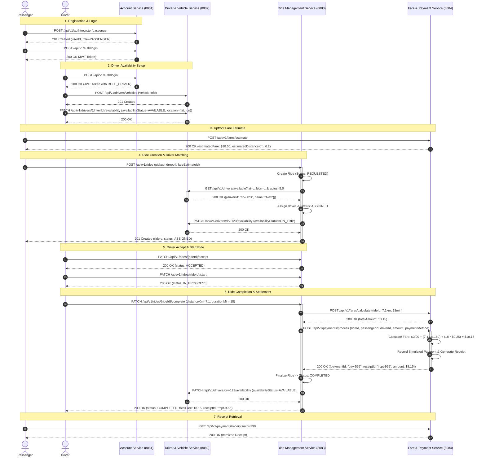

# RideLink Sequence Diagrams

## 1. End-to-End Ride Lifecycle Sequence Diagram

```mermaid
sequenceDiagram
    autonumber
    actor Passenger as Passenger
    actor Driver as Driver
    participant S1 as Account Service (8081)
    participant S2 as Driver & Vehicle Service (8082)
    participant S3 as Ride Management Service (8083)
    participant S4 as Fare & Payment Service (8084)

    Note over Passenger, S1: 1. Registration & Login
    Passenger->>S1: POST /api/v1/auth/register/passenger
    S1-->>Passenger: 201 Created (userId, role=PASSENGER)
    Passenger->>S1: POST /api/v1/auth/login
    S1-->>Passenger: 200 OK (JWT Token)

    Note over Driver, S2: 2. Driver Availability Setup
    Driver->>S1: POST /api/v1/auth/login
    S1-->>Driver: 200 OK (JWT Token with ROLE_DRIVER)
    Driver->>S2: POST /api/v1/drivers/vehicles (Vehicle Info)
    S2-->>Driver: 201 Created
    Driver->>S2: PATCH /api/v1/drivers/{driverId}/availability (availabilityStatus=AVAILABLE, location={lat, lon})
    S2-->>Driver: 200 OK

    Note over Passenger, S4: 3. Upfront Fare Estimate
    Passenger->>S4: POST /api/v1/fares/estimate
    S4-->>Passenger: 200 OK (estimatedFare: $18.50, estimatedDistanceKm: 6.2)

    Note over Passenger, S3: 4. Ride Creation & Driver Matching
    Passenger->>S3: POST /api/v1/rides (pickup, dropoff, fareEstimateId)
    activate S3
    S3->>S3: Create Ride (Status: REQUESTED)
    
    %% Inter-service call 1
    S3->>S2: GET /api/v1/drivers/available?lat=...&lon=...&radius=5.0
    activate S2
    S2-->>S3: 200 OK ([{driverId: "drv-123", name: "Alex"}])
    deactivate S2
    
    S3->>S3: Assign driver -> Status: ASSIGNED
    S3->>S2: PATCH /api/v1/drivers/drv-123/availability (availabilityStatus=ON_TRIP)
    S2-->>S3: 200 OK
    S3-->>Passenger: 201 Created (rideId, status: ASSIGNED)
    deactivate S3

    Note over Driver, S3: 5. Driver Accept & Start Ride
    Driver->>S3: PATCH /api/v1/rides/{rideId}/accept
    S3-->>Driver: 200 OK (status: ACCEPTED)
    Driver->>S3: PATCH /api/v1/rides/{rideId}/start
    S3-->>Driver: 200 OK (status: IN_PROGRESS)

    Note over Driver, S4: 6. Ride Completion & Settlement
    Driver->>S3: PATCH /api/v1/rides/{rideId}/complete (distanceKm=7.1, durationMin=18)
    activate S3
    
    %% Inter-service call 2
    S3->>S4: POST /api/v1/fares/calculate (rideId, 7.1km, 18min)
    S4-->>S3: 200 OK (totalAmount: 18.15)
    S3->>S4: POST /api/v1/payments/process (rideId, passengerId, driverId, amount, paymentMethod)
    activate S4
    S4->>S4: Calculate Fare: $3.00 + (7.1 * $1.50) + (18 * $0.25) = $18.15
    S4->>S4: Record Simulated Payment & Generate Receipt
    S4-->>S3: 200 OK ({paymentId: "pay-555", receiptId: "rcpt-999", amount: 18.15})
    deactivate S4
    
    S3->>S3: Finalize Ride -> Status: COMPLETED
    S3->>S2: PATCH /api/v1/drivers/drv-123/availability (availabilityStatus=AVAILABLE)
    S2-->>S3: 200 OK
    S3-->>Driver: 200 OK (status: COMPLETED, totalFare: 18.15, receiptId: "rcpt-999")
    deactivate S3

    Note over Passenger, S4: 7. Receipt Retrieval
    Passenger->>S4: GET /api/v1/payments/receipts/rcpt-999
    S4-->>Passenger: 200 OK (Itemized Receipt)
```
